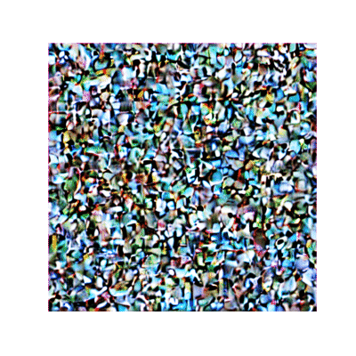
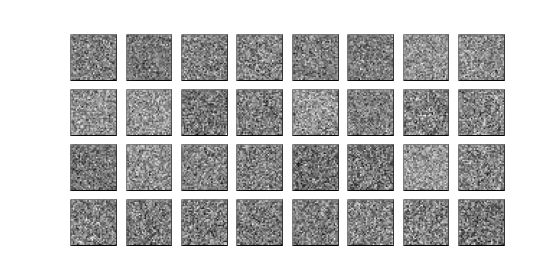
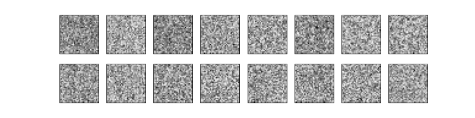

# NFT Generator
[BAYC (Bored Ape Yacht Club)](https://boredapeyachtclub.com/#/) image generator based on diffusion model, implemented from scratch using PyTorch. 

### Example
<p align="center">
  
</p>

### Model Architecture
The generator is based on diffusion model and borrows many ideas from [Stable Diffusion](https://github.com/Stability-AI/stablediffusion) (except CLIP due to computational constraints). The training is done using cosine noise schedule (as illustrated in [this paper](https://arxiv.org/pdf/2102.09672.pdf)). Currently supports DDIM sampling method, but in the future [PNDM](https://github.com/huggingface/diffusers/blob/main/src/diffusers/schedulers/scheduling_pndm.py) and [k-LMS](https://github.com/huggingface/diffusers/blob/main/src/diffusers/schedulers/scheduling_lms_discrete.py) will be added to the pipeline. In order to increase training efficiency, UNet is trained on latent representation of raw images from VAE (with compression factor of 48), which is later decoded to generate samples in the original scale.

### Sampling
Once the model is trained, generating new samples is very simple. Below code snippet can be used to generate new BAYC NFT images using 20 steps of DDIM.
```python
import torch
from pathlib import Path
from utils import sample, ddim_step, latents_to_img
from models import UNet2DModel, UNet2DConditionModel
from display import plot_sample, plot_sample_one
from IPython.display import HTML

device = "cuda" if torch.cuda.is_available() else "cpu"

save_dir = Path("./weights")

# load the pre-trained model (see bayc_training.ipynb notebook for detail)
model = UNet2DModel(in_channels=4, out_channels=4, nfs=(32,64,128,256), num_layers=2).to("cuda")
model.load_state_dict(torch.load("bayc_model_16_bs_16.pth"))
model.eval()
print("loaded in model with context")

# generate sample
sz = (16,4,64,64)
random_select = torch.randint(0,16,(1,))

# load VAE model
from diffusers import AutoencoderKL
vae = AutoencoderKL.from_pretrained("CompVis/stable-diffusion-v1-4", subfolder="vae").to(device)

# generate samples using DDIM with 20 steps 
samples, intermediates = sample(ddim_step, model, sz, steps=20)
intermediates = torch.tensor(intermediates[:,random_select]).view(-1,4,64,64).to("cuda")
intermediates_decoded = latents_to_img(vae, intermediates)
anim = plot_sample_one(intermediates_decoded, save_as="BAYC_uncond.gif")
HTML(anim.to_jshtml())
```

### Further examples
#### Unconditional Model
Below is an illustration of denoising process for the [EMNIST dataset](https://www.nist.gov/itl/products-and-services/emnist-dataset):
<p align="center">
  
</p>

#### Conditional Model
Below is an illustration of denoising process for the [Fashion MNIST dataset](https://github.com/zalandoresearch/fashion-mnist), generating T-shirts images (`cid=0`):
<p align="center">
  
</p>

### Data
The model is trained on all of 10,000 Bored Ape Yacht Club NFT (ipfs) images collected from [skogard/apebase](https://github.com/skogard/apebase).
